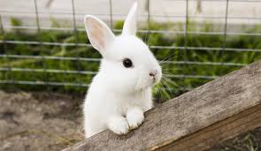

# Popular animals dataset
### Images of 22 animals most abundantly searched on Google search

|||||||||||
|--|--|--|--|--|--|--|--|--|--|
|||||||||||
|||||||||||||

## Stats 
**Number of classes: 22**

|Class|Number of images|Class|Number of images|
|--|--|--|--|
|ape|75|fish|86|
|bear|114|horse|86|
|bison|101|lion|84|
|cat|87|lobster|89|
|chicken|88|pig|90|
|cow|114|rabbit|92|
|deer|102|shark|80|
|dog|93|snake|100|
|dolphin|91|spider|89|
|duck|73|turkey|92|
|eagle|83|wolf|88|

### Made with lots of ⏱️, 📚 and ☕ by InputBlackBoxOutput
